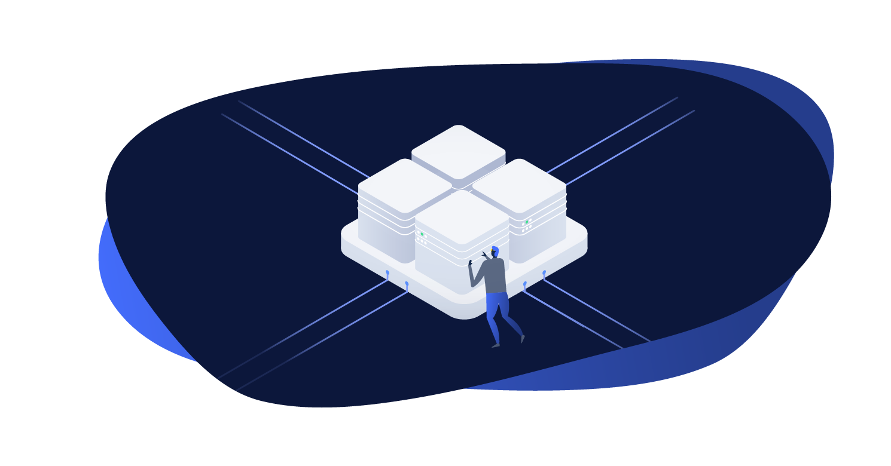

# Local Server



The Local Server module providers a local development environment for Altis projects. It is built on a containerized architecture
using Docker images and Docker Compose to provide drop-in replacements for most components of the Cloud infrastructure.

## Installing

**Windows Users:** Consult the [Windows setup documentation](./windows.md) to set up a WSL environment before using Local Server.

Local Server uses Docker for containerization, therefore you must install the Docker runtime on your computer as a prerequisite.
Download and install Docker for your OS at [https://www.docker.com/get-started](https://www.docker.com/get-started).

Once Docker is installed and running, you are ready to start the Local Server. Local Server uses the command line via the `composer`
command.

Navigate your shell to your project's directory. You should already have installed Altis by running `composer install`
or `composer create-project` but if not, do so now.
See [Creating A New Altis Project](https://www.altis-dxp.com/resources/docs/getting-started/#creating-a-new-altis-project).

#### Mutagen

You may find that file sharing performance or server response times are slower than you would like on Windows or MacOS. Local Server
provides an integration with [Mutagen](https://mutagen.io/) to resolve this.

See the [Mutagen set up guide for detailed instructions on how to install and run it](./mutagen-file-sharing.md).

#### Subdomain and Custom domains in multisites

Altis supports Subdomain multisites and Custom domains, where projects can choose custom domains for their local environments,
instead of being locked to the `altis.dev` domain. This is in part facilitated by the new SSL certificate generation features
introduced in Altis v12.

The subdomain / domain *optional* config options can be configured as follows:

```json
{
    "extra": {
        "altis": {
            "modules": {
                "local-server": {
                    "name": "my-project",
                    "tld": "my-company.local",
                    "domains": [
                        "domain1.com",
                        "domain2.com"
                    ]
                }
            }
        }
    }
}
```

- `name` - Project name, used as the subdomain of the primary site, e.g. `my-project`
- `tld` - TLD of the project, e.g. `my-company.local`
- `domains` - Custom domains used by the project, either for main or sub sites.

Note: Altis does not manage the host entries for subdomains or custom domains, you'll need to manage those manually, via
editing `/etc/hosts` in Linux / macOS, or `C:\Windows\System32\Drivers\etc\hosts` in Windows. Altis however tries to detect if those
entries do not exist, and outputs the necessary configurations to add to your `hosts` file.

Note: Before *updating* the custom domain configuration parameters, ensure that you've destroyed existing containers first before
applying your changes, otherwise you'll be leaving orphan containers from the previous configuration.

## Starting the Local Server

To start the Local Server, run `composer server`. The first time you run this it will download all the necessary Docker images.

Once the initial download and install has completed, you should see the output:

```sh
Installed database.
WP Username:    admin
WP Password:    password
Startup completed.
To access your site visit: https://my-site.altis.dev/
```

Visiting your site's URL should now work. Visit `/wp-admin/` and login with the username `admin` and password `password` to get
started!

> [If the server does not start for any reason take a look at the troubleshooting guide](./troubleshooting.md)

### Multisite Subdomains / Custom domains support

Altis supports multisite subdomains and custom domains. In order to support custom (sub) domains, Altis uses 
[`mkcert`](https://github.com/FiloSottile/mkcert) to generate SSL certificates based on a generated Root Certificate Authority (CA)
that is uniquely-generated and trusted on the host machine upon installation. This allows Altis local-server to generate local
SSL certificates that are automatically trusted, which provides a convenient and seamless local development experience.

Note: Altis local-server automatically collects domains names to issue the SSL certificate for, based on Altis configuration
in `composer.json`, namely the `altis.modules.local-server` tree, specifically the `name`, `tld`, and `domains` config parameters.

## Available Commands

- `composer server start [--xdebug=<mode>] [--mutagen]` - Starts the containers.
  - `--xdebug=<mode>` will enable Xdebug. The `mode` is optional and defaults to `debug`. Available values
      are `off`, `develop`, `debug`, `profile`, `coverage`, `gcstats` and `trace`.
  - `--mutagen` will enable Mutagen for container file sharing.
- `composer server stop [<service>] [--clean]` - Stops the containers or specified service.
  - `--clean` will also stop the proxy container if no service is specified, only use this if you have no other instances of Local
      Server
  - `--tmp` will mount the PHP container's `/tmp` directory to `.tmp` in your project root. This is useful for debugging
      with `--xdebug=profile` as the Cachegrind files are easily available
- `composer server restart [<service>]` - Restart a given container, or all containers if none is provided. Available values
  are `nginx`, `php`, `db`, `redis`, `cavalcade`, `tachyon`, `s3` and `elasticsearch`.
- `composer server destroy [--clean]` - Stops and destroys all containers.
  - `--clean` will also destroy the proxy container, only use this if you have no other instances of Local Server
- `composer server status` - Displays the status of all containers.
- `composer server ssl` - Shows the status of local-server SSL certificate.
  - `composer server ssl install` - Install `mkcert` locally and set it up to prepare for SSL generation.
  - `composer server ssl generate custom-domain.com` - (re)generates the local-server SSL certificate
      including `custom-domain.com`
  - `composer server ssl exec -- [<command>]` - Execute custom `mkcert` commands, e.g. `-uninstall` to revoke the root CA
- `composer server logs <service>` - Tail the logs from a given service, defaults to `php`, available options
  are `nginx`, `php`, `db|mysql|sql`, `redis`, `cavalcade`, `tachyon`, `s3` and `elasticsearch`.
- `composer server shell` - Logs in to the PHP container.
- `composer server cli|wp -- <command>` - Runs a WP CLI command. Use either `cli` or `wp`. For example,
  `composer server cli -- info` or `composer server wp -- info`. Do not include `wp` in `<command>`.
  - `composer server cli -- db import database.sql` - Imports a database file located in the project root.
- `composer server create-alias` - Create a WP CLI alias. Useful if you have WP CLI installed locally.
- `composer server exec -- <command>` - Runs any command on the PHP container.
- `composer server db` - Logs into MySQL on the DB container.
  - `composer server db info` - Print MySQL connection details.
  - `composer server db (sequel|spf)` - Opens a connection to the database in [Sequel Ace](https://sequel-ace.com/).
  - `composer server db (tableplus|tbp)` - Opens a connection to the database in [Table Plus](https://tableplus.com/).
- `composer server import-uploads` - Syncs files from `content/uploads` to the S3 container.
