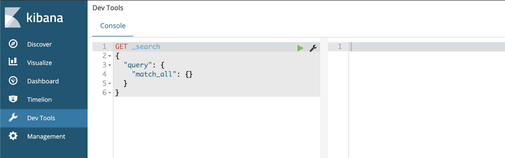
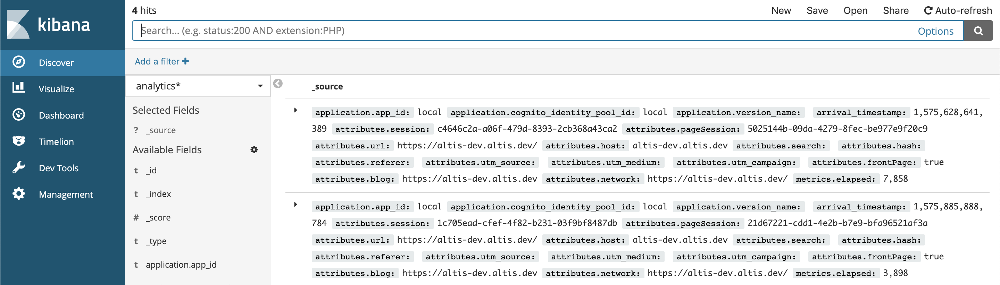

# ElasticSearch

ElasticSearch is an integral component of Altis, enabling enhanced search and relevancy as well as powering the analytics data query layer.

## Available Versions

Elasticsearch defaults to version 6.8 however you can change the version in your config:

```json
{
	"extra": {
		"altis": {
			"modules": {
				"local-server": {
					"elasticsearch": "7.10"
				}
			}
		}
	}
}
```

The current available versions are:

- 7.10
- 6.8 (default)
- 6.3

You can also use the major version on its own to get the latest minor version, for example "6" will resolve to version "6.8".

## Kibana

Local Server provides [Kibana](https://www.elastic.co/products/kibana) out of the box, a powerful tool for viewing indexes, creating and debugging queries and more.

Kibana is available at [`/kibana/`](internal://site/kibana/).

The version will always match the current Elasticsearch version.

### Adding Index Patterns

Before you can get started querying in Kibana you will need to add some index patterns. This is slightly different depending on your current version.

1. Go to the "Management" tab, or "Stack Management" if using Elasticsearch 7.x
1. Select "Index Patterns"
1. Click the "Create Index Pattern" button
1. Enter a pattern to match indexes from the list, you can use asterisks as wildcards
  - A good first pattern is `analytics*` for viewing your native analytics data
1. Click "Next Step"
1. Choose a time field if applicable, or "I don't want to use the time filter" if your data is not time based
  - For the `analytics*` pattern choose `attributes.date` for the time field
  - For a posts index you could use `post_date` to see publishing activity over time

You can add additional index patterns from the Management section at any time.
### Developing & Debugging Queries

Use the Dev Tools tab to enter and run queries. This provides useful features including linting and autocompletion based on your data.



### Viewing & Understanding Data

The easiest way to view your data is in the Discover tab. You will need to create some index patterns first before you can explore your data here.

You can create basic queries, select and sort by columns as well as drill down into the indexed data to see it's structure and data types.



## Accessing ElasticSearch Directly

The ElasticSearch hostname is not directly exposed however you can find the dynamic port and IP to connect to by running `composer server status | grep elasticsearch`.

You should see output similar to this:

```
project_elasticsearch_1   /elastic-entrypoint.sh ela ...   Up (healthy)   0.0.0.0:32871->9200/tcp, 9300/tcp
```

Copy the mapped IP and port (`0.0.0.0:32871` in the example above) and use it to query ElasticSearch directly:

```
curl -XGET http://0.0.0.0:32871
```

## ElasticSearch Memory Limit

ElasticSearch requires more memory on certain operating systems such as Ubuntu or when using Continuous Integration services. If ElasticSearch does not have enough memory it can cause other services to stop working. The Local Server supports an environment variable which can change the default memory limit for ElasticSearch called `ES_MEM_LIMIT`.

You can set the `ES_MEM_LIMIT` variable in 2 ways:

- Set it globally eg: `export ES_MEM_LIMIT=2g`
- Set it for the local server process only: `ES_MEM_LIMIT=2g composer server start`
