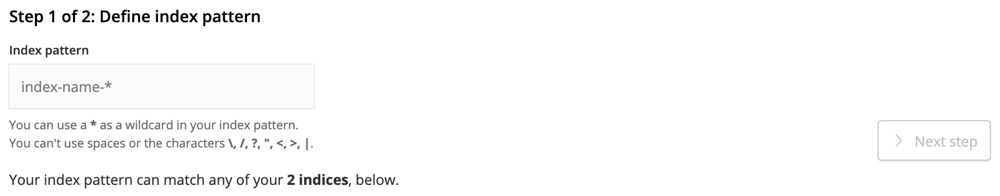

# ElasticSearch

ElasticSearch is an integral component of Altis, enabling enhanced search and relevancy as well as powering the analytics data query layer.

## Kibana

Local Server provides [Kibana](https://www.elastic.co/products/kibana) out of the box, a powerful tool for viewing indexes, creating and debugging queries and more.

Kibana is available at [`/kibana/`](internal://site/kibana/).

### Adding Index Patterns

Before you can get started querying in Kibana you'll need to [add some index patterns at `/kibana/app/kibana#/management/kibana/index/`](internal://site/kibana/app/kibana#/management/kibana/index/).



Enter an index pattern into the field (available indexes are shown below) using wildcards if you wish to work across multiple indexes at a time. You will then be prompted to choose a date field to use for time series filters, make your selection, for example `post_date`, and save your index pattern to start analysing your data.

You can add additional index patterns from the Kibana Management page in future.

**Note**: When adding an index pattern for the `analytics` index choose "I don't want to use the Time Filter" from the dropdown on the next screen. Analytics event timestamps are stored in milliseconds and Kibana's time filter does not currently work with this by default.

### Developing & Debugging Queries

Use the [Dev Tools tab at `/kibana/app/kibana#/dev_tools/console`](internal://site/kibana/app/kibana#/dev_tools/console) to enter and run queries. This provides useful features including autocomplete based on your data and linting.


### Viewing & Understanding Data

The easiest way to view your data is in the [Discover tab at `/kibana/app/kibana#/discover`](internal://site/kibana/app/kibana#/discover). Here you can create basic queries, select and sort by columns as well drill down into the indexed data to see it's structure and data types.


## Accessing ElasticSearch Directly

The ElasticSearch hostname is not directly exposed however you can find the dynamic port and IP to connect to by running `composer server status | grep elasticsearch`.

You should see output similar to this:

<pre><code>
project_elasticsearch_1   /elastic-entrypoint.sh ela ...   Up (healthy)   <strong>0.0.0.0:32871</strong>->9200/tcp, 9300/tcp
</code></pre>

Copy the mapped IP and port (highlighted in bold above) and use it to query ElasticSearch directly:

```
curl -XGET http://0.0.0.0:32871
```

## Configuration updates when using ElasticSearch on Local Environment

ElasticSearch uses more memory within the local server environment, which can also cause services to stop working,n particularly when using Ubuntu. Altis includes an environment variable which can change the default memory limit for ElasticSearch called `ES_MEM_LIMIT`. 

### Change variable during current session only

Using this variable with the `composer server start` command, users can update the memory limit for the current session only; it won't change the variable permenantly. An example might be: 

`ES_MEM_LIMIT=2g composer server start`

### Change variable permanently

Users can also define that environment variable on the container's config file if they wanted a permanent fix. For instance, editing or adding the variable to the "environment" section of the [/docker-compose.yml](https://github.com/humanmade/altis-local-server/blob/master/docker/docker-compose.yml) Altis Local Server setup.
