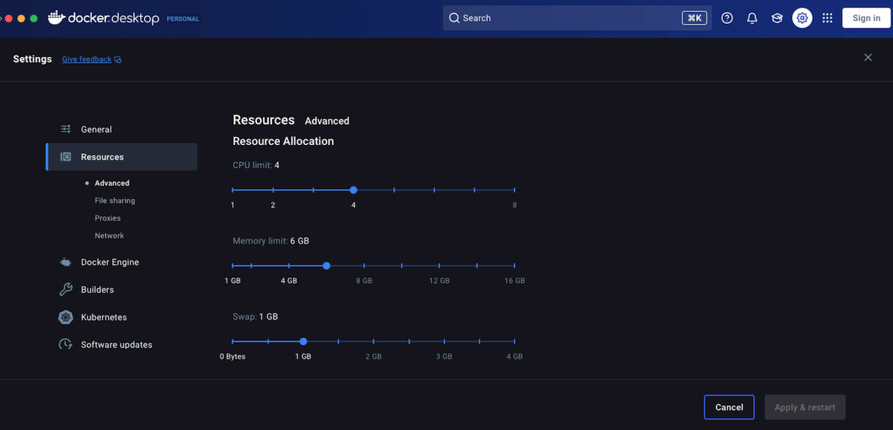

# Troubleshooting

## Getting the Local Server status

To get details on the running Local Server status and containers, run `composer server status`. You should see output similar to:

```sh
        Name                        Command               State                  Ports
-----------------------------------------------------------------------------------------------------
my-site_cavalcade_1       /usr/local/bin/cavalcade         Up
my-site_db_1              docker-entrypoint.sh mysqld      Up       0.0.0.0:32818->3306/tcp
my-site_elasticsearch_1   /elastic-entrypoint.sh ela ...   Up       0.0.0.0:32821->9200/tcp, 9300/tcp
my-site_nginx_1           nginx -g daemon off;             Up       80/tcp, 0.0.0.0:32823->8080/tcp
my-site_php_1             /docker-entrypoint.sh php-fpm    Up       0.0.0.0:32822->9000/tcp
my-site_redis_1           docker-entrypoint.sh redis ...   Up       0.0.0.0:32820->6379/tcp
my-site_s3_1              fakes3 server --root . --p ...   Up       0.0.0.0:32819->8000/tcp
my-site_tachyon_1         node server.js --debug           Up       0.0.0.0:8081->8080/tcp
my-site_xray_1            /usr/bin/xray -b 0.0.0.0:2000    Up       0.0.0.0:32817->2000/tcp, 2000/udp
```

All containers should have a status of "Up". If they do not, you can inspect the logs for each service by running `composer server logs <service>`, for example, if `site_db_1` shows a status other than "Up", run `composer server logs db`.

## Services keep stopping

By default docker machine sets a default memory limit of 2GB for all of your containers. Because of this if your system becomes too busy or you're running multiple instances of local server it is recommended to increase this limit to at least 4GB.

In the docker GUI go to the "Preferences" pane, then the "Advanced" tab and move the memory slider up.



## ElasticSearch service fails to start

ElasticSearch requires more memory on certain operating systems such as Ubuntu or when using Continuous Integration services. If ElasticSearch does not have enough memory it can cause other services to stop working. The Local Server supports an environment variable which can change the default memory limit for ElasticSearch called `ES_MEM_LIMIT`.

You can set the `ES_MEM_LIMIT` variable in 2 ways:

- Set it globally eg: `export ES_MEM_LIMIT=2g`
- Set it for the local server process only: `ES_MEM_LIMIT=2g composer server start`

Another problem can be related to the Docker Virtual Machine settings. In Linux environments the ElasticSearch container is in production mode and requires the setting `vm.max_map_count` to be increased. To do this edit the file `/etc/sysctl.conf` and add the following line:

```
vm.max_map_count=262144
```

You can also apply the setting live using the following command:

```
sysctl -w vm.max_map_count=262144
```

## Windows 10 Home Edition

Docker Desktop for Windows uses Windows-native Hyper-V virtualization and networking, which is not available in the Windows 10 Home edition. If you are using Windows 10 Home Edition you will need to use the [Local Chassis](docs://local-chassis) environment.
