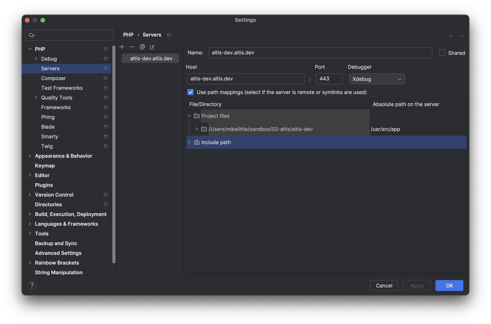

# Using XDebug

Bugs are an inevitability of writing code and so Local Server provides an easy way to enable [XDebug](https://xdebug.org/) when you need it.

XDebug is _not enabled by default_ because it slows PHP down considerably. This could make you less productive depending on the work you're doing.

## Activating XDebug

When you need to run your debug client you can append the option `--xdebug` to the start command:

```
composer server --xdebug
```

**Note**: you do not need to stop the server first to run the above command.

## Deactivating XDebug

You can start the server again without the `--xdebug` option at any time to deactivate XDebug:

```
composer server
```

## Connecting to XDebug

Most modern editors will have a built in debug client. Instructions for the following editors are below:

- [VSCode](#VSCode)
- [PHPStorm](#PHPStorm)

XDebug is configured to connect to the default port 9000 so there should be a minimum of configuration required in your editor.

### VSCode

1. Open the debug tab (the bug icon on the menu sidebar).
2. In the dropdown menu at the top of the left hand side bar choose "Add configuration".
3. In the popup that appears select "PHP" as your environment.
4. You will be taken a new file called `.vscode/launch.json` with the default settings:
   ```json
   {
     "version": "0.2.0",
     "configurations": [
       {
         "name": "Listen for XDebug",
         "type": "php",
         "request": "launch",
         "port": 9000
       },
       {
         "name": "Launch currently open script",
         "type": "php",
         "request": "launch",
         "program": "${file}",
         "cwd": "${fileDirname}",
         "port": 9000,
       }
     ]
   }
   ```
5. Add the following `pathMappings` property to each configuration:
   ```json
   {
     "version": "0.2.0",
     "configurations": [
       {
         "name": "Listen for XDebug",
         "type": "php",
         "request": "launch",
         "port": 9000,
         "pathMappings": {
           "/usr/src/app": "${workspaceRoot}"
         }
       },
       {
         "name": "Launch currently open script",
         "type": "php",
         "request": "launch",
         "program": "${file}",
         "cwd": "${fileDirname}",
         "port": 9000,
         "pathMappings": {
           "/usr/src/app": "${workspaceRoot}"
         }
       }
     ]
   }
   ```
6. You are done, click the green play button to start the debug client.

For more information on the available configuration options, including XDebug settings, [view the VSCode Debugging documentation here](https://go.microsoft.com/fwlink/?linkid=830387).

### PHPStorm

Local Server takes advantage of PHPStorm's [Zero Configuration Debugging](https://www.jetbrains.com/help/phpstorm/zero-configuration-debugging.html). All you need to do is tell it about the server by following these steps:

1. Go to [Preferences > Languages & Frameworks > PHP > Servers](jetbrains://PhpStorm/settings?name=Languages+%26+Frameworks--PHP--Servers) (link opens in PHPStorm).
2. Click the plus icon and create a new Server entry with the following settings:
   - The name should be your project host name: `<my-project>.altis.dev`
   - The host name should also be: `<my-project>.altis.dev`
   - Port: `443`
   - Check the "Use path mappings" box
   - Next to your project's root directory enter `/usr/src/app`
   
3. Set some breakpoints and click the "Listen for Debug Connections" icon<br />
   
